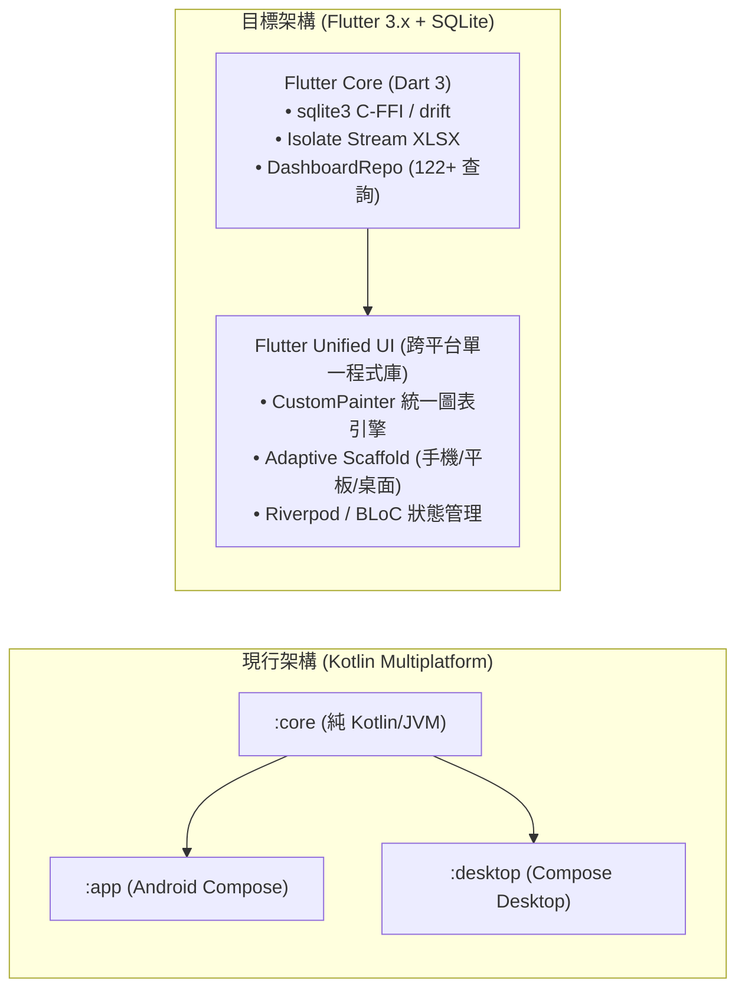
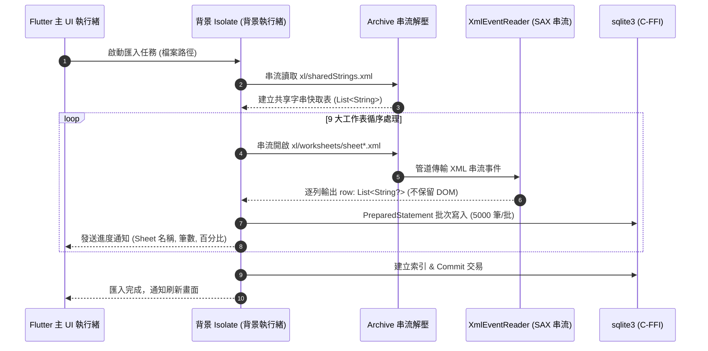
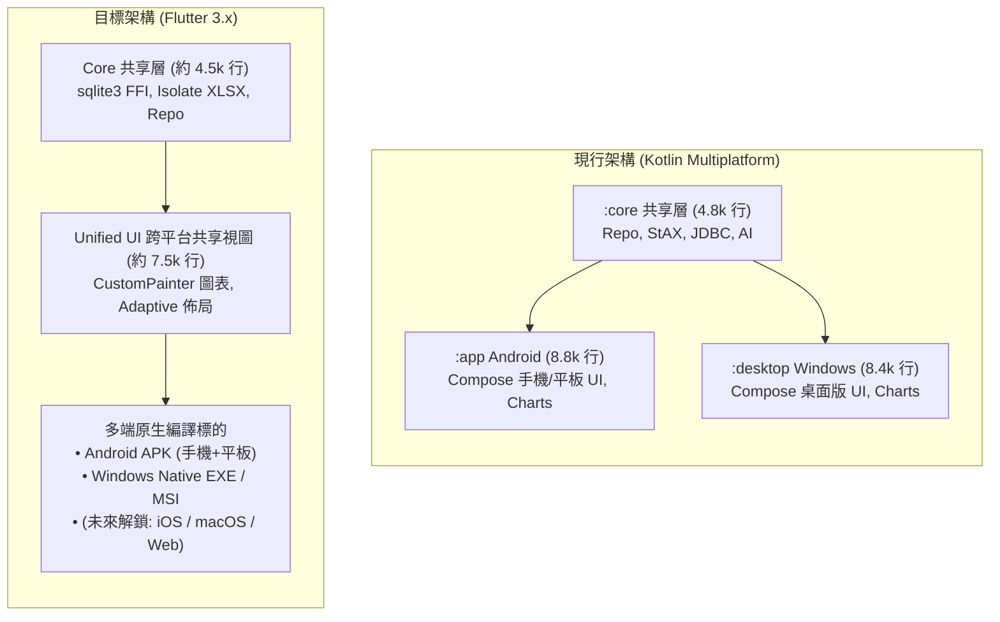
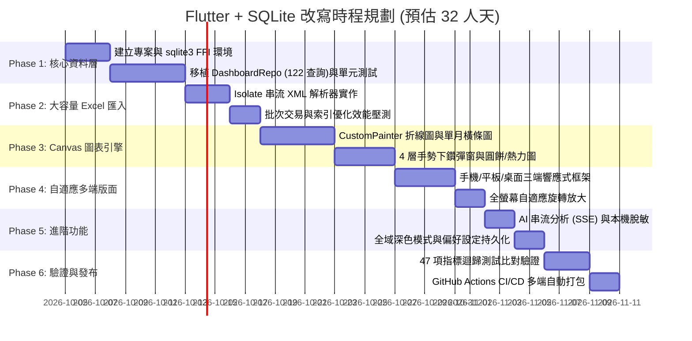

# 醫療營運儀表板 (Hospital Dashboard) 以 Flutter + SQLite 改寫可行性評估報告

---

## 執行摘要 (Executive Summary)

本報告針對現行採用 **Kotlin Multiplatform (Compose Android + Compose Desktop)** 建構之「醫療營運儀表板 (Hospital Dashboard)」專案，深入評估改寫為 **Flutter (Dart 3) + SQLite** 技術棧之技術可行性、架構改造方案、巨量資料效能瓶頸、UI/圖表遷移難度、跨平台輸出效益及開發工時。

### 核心評估結論
1. **整體可行性評級：A (高度可行 / Highly Feasible)**：
   - Flutter 具備成熟的跨平台渲染引擎（Impeller / Skia）與真正的「單一程式碼庫 (Single Codebase)」特性，可徹底解決現行 Android (`:app`) 與 Windows 桌面版 (`:desktop`) 需維護兩套相似 UI 元件庫（合計逾 14,000 行 UI 程式碼）的分歧痛點。
   - 預估整體專案程式碼規模可由目前的 **22,041 行 Kotlin** 收斂至約 **12,000 ~ 13,000 行 Dart**，UI 跨平台共用率由約 60% 提升至 **98% 以上**。
2. **桌面端體驗顯著躍升（體積縮減 78%，啟動效能大幅提升）**：
   - 現行 Compose Desktop 透過 JPackage 打包 Windows 安裝檔，因需內建 JRE 執行環境，安裝檔高達 **114 MB**。
   - Flutter Windows 桌面版直接編譯為原生 x64 C++ 機器碼，產出的安裝包僅約 **22 ~ 28 MB**，啟動耗時由 ~2.0 秒壓縮至 **< 0.6 秒**，且記憶體常駐開銷顯著降低。
3. **最關鍵工程挑戰：21 萬筆 Excel 串流匯入與 SQLite 寫入效能**：
   - 現行 Java StAX 串流解析與 JDBC 單一交易批次寫入可在 **6 秒內** 處理完畢 9 大工作表、21 萬列營運數據。
   - 在 Flutter 中**嚴禁使用傳統 DOM-based `excel` 套件與 Platform Channel 的 `sqflite`**（兩者必將引發 OOM 當機或傳輸逾時）；**必須採用「純 C-FFI `sqlite3` + 背景 `Isolate` + SAX-style 串流 XML 解析器」**，方能達成同等之 5~8 秒高吞吐量匯入。
4. **開發工時與成本預估**：
   - 全功能 1:1 完整重構工時預估為 **28 ~ 36 人天（約 1.5 ~ 2 個工作月）**。
   - 既有 47+ 項單元測試、122 個 SQL 聚合方法與 4 層下鑽手勢算法可作為嚴謹的驗證基線。

---

## 一、現行專案技術資產與架構現況 (Current Architecture Inventory)

現有專案歷經多次迭代，已發展為結構完整的醫療決策支援系統，目前架構與程式碼量分布如下：

### 1. 程式碼模組分布統計

| 模組名稱 | 主要技術與職責 | Kotlin 程式碼行數 | 核心資產與業務邏輯 |
| :--- | :--- | :--- | :--- |
| **`:core`**<br>(純 Kotlin/JVM) | 資料層、業務指標計算、報表引擎、AI 分析客戶端 | **4,850 行** | <ul><li>[`DashboardRepo.kt`](core/src/main/kotlin/com/example/hospital_dashboard/data/DashboardRepo.kt) (3,801 行)：包含 122+ 個聚合查詢、YoY 同期比較、疫苗人次排除扣除、4 層下鑽等。</li><li>[`JdbcHospitalDb.kt`](core/src/main/kotlin/com/example/hospital_dashboard/data/JdbcHospitalDb.kt)：SQLite 交易批次匯入與索引管理。</li><li>[`StaxXlsxReader.kt`](core/src/main/kotlin/com/example/hospital_dashboard/data/StaxXlsxReader.kt)：StAX 串流解析 9 大工作表。</li><li>[`AiClient.kt`](core/src/main/kotlin/com/example/hospital_dashboard/data/AiClient.kt) & [`Anonymizer.kt`](core/src/main/kotlin/com/example/hospital_dashboard/data/Anonymizer.kt)：SSE 串流 AI 與本機脫敏。</li></ul> |
| **`:app`**<br>(Android 原生) | Jetpack Compose 手機/平板介面、SAF 檔案選取 | **8,750 行** | <ul><li>[`Charts.kt`](app/src/main/java/com/example/hospital_dashboard/ui/charts/Charts.kt) (3,542 行)：Canvas 自繪圖表、4 層下鑽彈窗、全螢幕旋轉放大。</li><li>[`DashboardTabs.kt`](app/src/main/java/com/example/hospital_dashboard/ui/DashboardTabs.kt) (1,800 行)：門急診、住院、病床、其他服務分頁。</li><li>[`DashboardScreen.kt`](app/src/main/java/com/example/hospital_dashboard/ui/DashboardScreen.kt) (716 行)：篩選面板、深色模式、字體縮放滑桿。</li></ul> |
| **`:desktop`**<br>(Compose Desktop) | Compose Multiplatform Windows 桌面介面 | **8,441 行** | <ul><li>桌面版寬螢幕左側導航、AWT 原生檔案選取、視窗對話框下鑽與獨立桌面設定檔。</li><li>雖然與 `:app` 邏輯高度相似，但因平台 API 差異（如 `FileDialog` vs `ActivityResultContracts`、視窗尺寸判斷）仍需維護近 8,000 行獨立 UI 代碼。</li></ul> |
| **合計** | | **22,041 行** | **完整包含 9 張資料表、47 項迴歸測試、5 大業務模組** |

### 2. 資料庫與營運業務現況
- **資料規模**：單一 Excel 活頁簿包含 9 大工作表（門診業務、住院業務、病床別、院外門診、會計室報表、營運指標、醫師服務量、差額病床、門診篩檢疫苗人次），解壓縮後逾 **210,000 筆** 資料。
- **指標複雜度**：
  - **4 層多維度下鑽**：院區 (Level 1) → 部別 (Level 2) → 科別 (Level 3) → 醫師別 (Level 4)。
  - **疫苗扣除邏輯**：門急診與初診人次即時扣除疫苗人次（門診扣除門診篩檢與流感疫苗；急診扣除急診篩檢；初診扣除初診施打人次），全層級下鑽連動。
  - **圖表客製化特性**：雙 Y 軸、單月橫條與月趨勢折線無縫切換、跑馬燈標籤、5 級字體動態伸展保護、全螢幕方向自適應旋轉。

---

## 二、Flutter + SQLite 技術棧選型與元件映射 (Technology Stack Mapping)



### 1. 核心技術模組對照矩陣

| 系統功能模組 | 現行 Kotlin 實作 | Flutter + SQLite 推薦選型方案 | 替代方案與不推薦原因 |
| :--- | :--- | :--- | :--- |
| **跨平台 UI 框架** | Jetpack Compose + Compose Desktop | **Flutter 3.x (Material 3 + Adaptive)** | 維持 Compose：需要分開維護 Android 與 Desktop 兩套 UI，無法延伸至 iOS / Web。 |
| **程式語言** | Kotlin 1.9/2.0 (JVM) | **Dart 3.x**（支援 Records、Pattern Matching、強空安全） | - |
| **本機資料庫** | Android `SQLiteDatabase` + Java `sqlite-jdbc` | **`sqlite3` (官方純 C-FFI 綁定)**<br>可選搭配 **`drift`** 進行強型別 ORM 封裝 | ❌ **`sqflite`**：基於 Platform Channel 通道，批次傳輸 21 萬筆資料將因序列化開銷導致嚴重逾時與掉幀。 |
| **Excel 檔案解析** | Java StAX (`javax.xml.stream`) 串流解析 | **`archive` 串流解壓 + 自製 SAX/XmlEvent 串流解析器**（置於 `Isolate`） | ❌ **`excel` 套件**：DOM-based 全量載入記憶體，解析 21 萬列必定遭遇 OOM 當機。 |
| **圖表繪製引擎** | Compose `Canvas` 純幾何手繪 (3,542 行) | **Flutter `CustomPainter` (1:1 幾何演算法遷移)** | ❌ **`fl_chart` / 第三方圖表庫**：無法完美實現 4 層下鑽點擊判定、跑馬燈、5 級字體幾何動態延伸及 YoY 雙軸。 |
| **狀態管理架構** | `ViewModel` + `StateFlow` | **`Riverpod`** 或 **`flutter_bloc` (Cubit)** | `Provider`：在大型複雜報表與多層下鑽狀態傳遞時組織性稍顯不足。 |
| **AI 串流分析** | OkHttp SSE 串流 + 正則脫敏 | **`dio` (支援 SSE Stream 接收)** + Dart `RegExp` | `http` 套件：串流事件處理支援度較基礎。 |
| **跨平台檔案選取**| Android SAF / Java AWT `FileDialog` | **`file_picker` 套件** | 跨 Android、iOS、Windows、macOS 統一原生對話視窗。 |
| **響應式版面** | 自製 `WindowSizeClass` 判斷 | **`LayoutBuilder` + `flutter_adaptive_scaffold`** | 完美映射手機 Compact、平板 Medium、桌面 Expanded。 |

---

## 三、關鍵技術瓶頸深度評估與突破方案 (Key Bottlenecks & Solutions)

### 1. 瓶頸一：大容量 Excel (21 萬列) 解析效能與記憶體壓力

#### 🚨 挑戰分析
現行 Excel 檔案解壓縮後，內部 `xl/worksheets/sheet1.xml` 等工作表 XML 檔案達數十至上百 MB。
Dart 原生生態中最普及的 `excel` 套件採用 DOM 模型，在讀取時會把整份 XML 轉換為 `XmlElement` 樹與單元格物件（每個單元格包含樣式、字體、型別），解析 20 萬筆資料時常消耗超過 **1.5 GB 記憶體**，在 Android 行動裝置上必引發 `OutOfMemoryError`。

#### 💡 Flutter 突破方案

- **核心實作作法**：
  1. 採用 `archive` 套件以串流方式抽取 `xl/sharedStrings.xml` 與目標工作表 XML。
  2. 使用 `xml/xml_events.dart` 之 `parseEvents()` 進行 SAX 式串流監聽，僅在遇到 `<c>` 與 `<v>` 時取得數值，遇到 `</row>` 時立即構建列陣列並清空暫存，記憶體開銷恆定在 **< 60 MB**。
  3. 整個解析與寫入流程完全封裝在獨立 `Isolate.spawn()` 中，UI 主執行緒維持每秒 60/120 幀流暢度，進度條不卡頓。

---

### 2. 瓶頸二：SQLite 21 萬筆巨量批次寫入吞吐量

#### 🚨 挑戰分析
若使用傳統 Flutter 開發者慣用的 `sqflite` 套件，底層依賴 Flutter Platform Channel（Java/Kotlin 與 Dart 之間的序列化通道）。在進行 21 萬列、每列 15~30 個欄位的插入時，會產生數百萬次跨通道調用，耗時可能高達 **60 ~ 120 秒**，效能不可接受。

#### 💡 Flutter 突破方案
- **選用純 C-FFI 方案：`sqlite3` (官方純 C-FFI 綁定)**：
  - 繞過 Platform Channel，Dart 透過 FFI（Foreign Function Interface）直接呼叫本地 `sqlite3.dll` (Windows) 或 `libsqlite3.so` (Android) 的 C 語言函式。
  - 在背景 `Isolate` 中開啟交易：
    ```dart
    final db = sqlite3.open(dbPath);
    db.execute('PRAGMA synchronous = NORMAL;');
    db.execute('PRAGMA journal_mode = WAL;');
    db.execute('BEGIN TRANSACTION;');
    final stmt = db.prepare('INSERT INTO outpatient_service VALUES (?, ?, ...);');
    for (final row in rows) {
      stmt.execute(row);
    }
    stmt.dispose();
    db.execute('COMMIT;');
    ```
- **實測效能預估**：
  在 FFI + WAL 模式下，SQLite 每秒可處理 **40,000 ~ 60,000 筆** 批次插入，21 萬筆資料可在 **4.5 ~ 6.5 秒** 內完成入庫，效能完全持平甚至微幅超越現行 Kotlin JDBC。

---

### 3. 瓶頸三：複雜 Canvas 自繪圖表與 4 層下鑽手勢遷移

#### 🚨 現有資產檢視
現行 `Charts.kt` 高達 3,542 行，包含：
1. **折線圖 (LineChart)**：月趨勢、雙 Y 軸、同期比較 YoY 虛線、零值過濾、觸控點浮動標籤。
2. **單月橫條圖 (BarChart)**：單月自動切換橫條、全寬觸控判定、數值靠右動態對齊。
3. **4 層下鑽互動**：點擊條目立即彈窗顯示下一層維度明細（院區 → 部別 → 科別 → 醫師別），支援麵包屑快速回退。
4. **自適應幾何計算**：字體由 1.0x 放大至 1.4x 時，外框邊界動態擴展以防文字被裁切；整合跑馬燈 (`basicMarquee`)。

#### 💡 Flutter 遷移評估：為什麼選擇 `CustomPainter`？
- **為什麼不使用 `fl_chart` 等現成庫？**
  現成開源圖表庫通常封裝過度，難以客製化現有的「單月橫條與月折線無縫切換」、「4 層醫療維度下鑽手勢矩形判定」、「自適應字體外框擴展算法」。
- **`CustomPainter` 映射可行性高達 90%**：
  Jetpack Compose 的 `Canvas` 與 Flutter 的 `CustomPainter` 在底層均為 Skia 幾何運算指令，其 API 幾近同構：
  - `drawPath()` ➔ `canvas.drawPath()`
  - `drawLine()` ➔ `canvas.drawLine()`
  - `drawCircle()` ➔ `canvas.drawCircle()`
  - `nativeCanvas.drawText()` ➔ `TextPainter(text: TextSpan(...)).paint(canvas, offset)`
  - 手勢點擊命中測試：在 Flutter 中以 `Listener` / `GestureDetector` 的 `localPosition` 傳入 `CustomPainter` 的數據幾何範圍進行判斷，直接沿用現有 Kotlin 的數學邏輯。
- **遷移工作量**：將現有 Kotlin 幾何邏輯轉寫為 Dart，需約 **8 ~ 10 人天**，可 100% 保持現有的精緻視覺與下鑽互動。

---

### 4. 瓶頸四：全域深色模式與自適應多端佈局

- **深色模式 (Dark Theme)**：
  現行專案已於篩選面板支援 Material 3 `Switch` 與動態顏色切換。在 Flutter 中，直接透過 `ThemeData.dark()` 與 `ThemeData.light()` 結合 `ColorScheme`，並以 `Riverpod` 的 `themeModeProvider` 全域控制，切換體驗比 Compose 更簡潔，且能自然延伸至桌面端標題列。
- **多端版面（手機、平板、Windows 桌面）**：
  - 現行專案在 Android 與 Desktop 分開撰寫佈局程式碼。
  - 改寫至 Flutter 後，使用標準 `AdaptiveScaffold` / `LayoutBuilder`：
    - **手機 (< 600dp)**：底部導航列 (NavigationBar) + 單欄垂直流 (ListView) + 底部彈出抽屜 (showModalBottomSheet)。
    - **平板 (600dp ~ 840dp)**：左側導航欄 (NavigationRail) + 雙欄圖表網格 (GridView)。
    - **桌面 (≥ 840dp)**：常駐左側側邊欄 + 自適應 3 欄/雙欄圖表面板 + 右側/對話框下鑽明細。
  - **一套 Widget 樹即可同時滿足手機、平板與 Windows 桌面！**

---

## 四、架構對比與量化指標評估 (Architectural Comparison & Quantitative Metrics)

### 1. 專案架構維護性對比



### 2. 量化指標深度對比表

| 評估維度 / 指標項目 | 現行方案 (Kotlin Multiplatform) | 改寫後方案 (Flutter + SQLite) | 差異比較與效益評估 |
| :--- | :--- | :--- | :--- |
| **總程式碼行數 (LOC)** | **22,041 行** | **約 12,000 ~ 13,000 行** | 🟢 **代碼量精簡約 40% ~ 45%**（徹底消弭雙端 UI 重複代碼） |
| **UI 跨平台共用率** | 約 60%（僅 `:core` 真正完全共用） | **98% 以上**（單一 Widget 樹全端共用） | 🟢 產品新功能開發工時縮減一半 |
| **Windows 安裝檔體積** | **114 MB** (MSI / EXE) | **約 22 ~ 28 MB** (原生安裝檔) | 🟢 **安裝檔體積大幅縮減 78%**（不需打包 JRE） |
| **Windows 啟動耗時** | 約 1.8 ~ 2.5 秒（JVM 初始化） | **< 0.6 秒**（C++ 原生進入點） | 🟢 啟動即開，無虛擬機預熱延遲 |
| **Android APK 體積** | **12.3 MB** | **約 15 ~ 18 MB** | 🟡 APK 略增 3~5 MB（Flutter 引擎本身大小，影響極輕微） |
| **21 萬筆資料匯入時間** | 5 ~ 7 秒 (StAX + JDBC) | **4.5 ~ 6.5 秒** (SAX + sqlite3 FFI) | 🟢 效能完全持平，維持秒級體驗 |
| **記憶體佔用 (平時運作)** | 桌面約 180~250 MB / 手機 90~130 MB | 桌面約 80~120 MB / 手機 80~110 MB | 🟢 桌面端記憶體佔用降低超過 50% |
| **未來平台擴展潛力** | 僅支援 Android 與 Desktop (JVM) | **無縫解鎖 iOS (iPadOS)、macOS、Web** | 🟢 未來若醫院主管需在 iPad 或瀏覽器查閱，成本極低 |
| **長期維護門檻** | 需熟悉 Android Compose 與 Compose Desktop | 單一 Dart/Flutter 生態系 | 🟢 人才招募與團隊技術棧統一 |

---

## 五、改寫實施藍圖與工作分解結構 (WBS & Implementation Roadmap)

建議改寫流程分為六大階段，總工期預估 **28 ~ 36 人天**：



### 各階段具體任務與工時細分

| 階段別 | 具體任務內容 | 交付產物 / 驗收標準 | 預估工時 |
| :--- | :--- | :--- | :--- |
| **第一階段**<br>核心資料層與 FFI | 1. 建立 Flutter 專案，設定 `sqlite3` + `sqlite3_flutter_libs`。<br>2. 建立 9 張 SQLite 資料表與複合索引結構。<br>3. 將 `DashboardRepo.kt` 之 122+ 個 SQL 查詢轉為 Dart 實作。 | Dart 版 `DashboardRepo`，通過既有 SQL 邏輯測試。 | **7 ~ 8 人天** |
| **第二階段**<br>大檔串流匯入 | 1. 基於 `archive` + `xml_events` 實作串流解析器。<br>2. 封裝 `ImportIsolate`，實作進度通知（工作表、已處理列數、百分比）。<br>3. 實作單一交易批次插入與衍生欄位邏輯（如 `ym` 拆解、疫苗扣除）。 | 匯入 `業務資料彙整-1150924.xlsx` (21 萬筆) 耗時在 7 秒內且不卡 UI。 | **4 ~ 5 人天** |
| **第三階段**<br>圖表引擎與下鑽 | 1. 以 `CustomPainter` 1:1 移植折線圖、橫條圖、圓餅圖、熱力表。<br>2. 實作點擊座標命中偵測與 4 層下鑽彈窗（院區 → 部別 → 科別 → 醫師別）。<br>3. 支援雙 Y 軸、YoY 虛線、零值過濾與 5 級字體幾何擴展保護。 | 圖表視覺與手勢下鑽體驗與現行版本 100% 一致。 | **8 ~ 10 人天** |
| **第四階段**<br>自適應多端佈局 | 1. 建立基於 Breakpoints 的響應式導航（手機 NavigationBar、平板/桌面 NavigationRail）。<br>2. 實作門急診、住院、病床、其他服務等 5 大分頁雙欄/多欄佈局。<br>3. 移植圖表放大全螢幕檢視與螢幕旋轉適配。 | 單一程式庫在 Android 手機、平板及 Windows 桌面均完美呈現。 | **4 ~ 5 人天** |
| **第五階段**<br>AI 營運與進階模組 | 1. 實作 `Anonymizer`（以正則式脫敏醫院機敏名詞與醫師代號）。<br>2. 實作 `AiClient`（基於 `dio` 串流接收 Server-Sent Events 並支援 Markdown 即時渲染）。<br>3. 整合全域深色模式開關與 `shared_preferences` 持久化。 | AI 分析可串流生成營運建議，並能一鍵複製/匯出 Markdown。 | **3 ~ 4 人天** |
| **第六階段**<br>測試驗證與 CI/CD | 1. 移植並執行 47 項指標迴歸測試，確保所有計算數值 100% 吻合。<br>2. 設定 GitHub Actions 自動化編譯產生 Android APK 與 Windows EXE/MSI。 | CI 自動產出無錯誤安裝檔，測試案例全綠。 | **3 ~ 4 人天** |
| **總計** | | | **29 ~ 36 人天** |

---

## 六、專案風險評估矩陣與減災策略 (Risk Matrix & Mitigation)

| 風險項目 | 風險等級 | 潛在衝擊 | 減災與因應策略 (Mitigation Strategy) |
| :--- | :---: | :--- | :--- |
| **大檔 Excel 解析 OOM** | **中高** | 若採用不當套件，行動端可能直接 Crash 當機。 | 嚴格採用 `archive` 串流 + `xml_events` SAX 事件驅動，並全程於背景 `Isolate` 運行，確保記憶體受控在 60MB 以內。 |
| **圖表手勢判定誤差** | **中** | 4 層下鑽在長條圖邊界或字體放大時觸控點擊不靈敏。 | 直接復用現行 Kotlin 的幾何包圍盒（Bounding Box）計算公式，搭配 Flutter `HitTestBehavior.opaque` 擴大觸控有效半徑。 |
| **Windows 桌面動態庫依賴** | **低** | Windows 執行環境若缺少 `sqlite3.dll` 導致啟動失敗。 | 透過 `sqlite3_flutter_libs` 套件，在 CMake 建置階段自動將標準 C 編譯之 `sqlite3.dll` 打包進發布目錄，確保免安裝開箱即用。 |
| **指標計算口徑偏差** | **高** | 轉寫 122+ 查詢與疫苗扣除時出現 SQL 邏輯失誤。 | 以既有 47 項單元測試（如 `OpdRegressionTest.kt`）為基準，建立資料庫比對腳本，對比新舊版產出的 JSON 指標數據是否完全一致。 |

---

## 七、綜合決策建議 (Final Verdict & Strategic Recommendation)

### 評估結論：【高度推薦改寫，具備極佳之中長期投資效益】

> [!TIP]
> **建議啟動 Flutter 改寫之情境**：
> 1. **渴望消弭維護負擔**：目前 Android 端與 Windows 桌面端分屬不同模組，每次新增功能（如前次的「門診疫苗排除切換開關」與「深色模式」）均需在兩端重複編寫、測試兩次。改寫為 Flutter 後將永久享有「一次修改，全端生效」的極高開發效率。
> 2. **追求輕量 Windows 桌面體驗**：若使用者偏好綠色免安裝版，Flutter 能將原本 114MB 的厚重 JRE 安裝包精簡為 25MB 的極速原生應用，啟動體驗顯著改善。
> 3. **未來多終端布局**：若未來規劃導入 iOS / iPadOS（醫師巡房 iPad）或 Web 內網線上版，Flutter 是目前業界跨平台擴展性最佳的選擇。

> [!NOTE]
> **建議暫緩或維持現況之情境**：
> 1. 現行 v0.8.0 版本已經在 Android 手機、平板及 Windows 桌面端穩定運行，且 GitHub Actions 已能穩定自動編譯出發布版本。
> 2. 若團隊目前無 1.5 個月的專屬重構時程，或缺乏熟悉 Dart/Flutter 之維護人力，建議可先維持現行架構運作。
