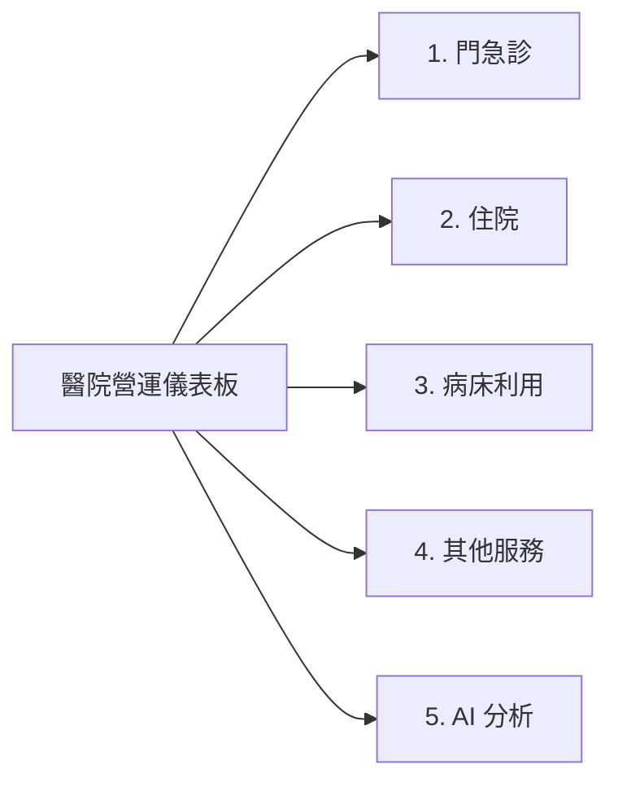

# 醫院營運儀表板 (Hospital Operations Dashboard) — Android

[](https://github.com/maria0010101/hospital_dashboard/releases/tag/0.8.0)
[](https://developer.android.com)
[](https://kotlinlang.org)
[](https://developer.android.com/jetpack/compose)

將 Python/Streamlit 版醫院業務儀表板完整改製為 Android 原生離線分析應用程式。使用者僅需選取本機業務報表 Excel 檔（`業務資料-YYYYMMDD.xlsx`），即可在無網路環境下完成十餘萬列資料的高效解析、SQLite 交易存儲、核心營運指標視覺化呈現、多層次下鑽分析與本機脫敏 AI 輔助決策。

---

## 📥 最新安裝檔下載 (v0.8.0)

- **專案內建載點**：[`release/hospital_dashboard_v0.8.0.apk`](release/hospital_dashboard_v0.8.0.apk)
- **GitHub Release 官方發布**：[Releases · maria0010101/hospital_dashboard](https://github.com/maria0010101/hospital_dashboard/releases/tag/0.8.0)

---

## 🌟 核心特色

1. **⚡ 零第三方依賴離線解析**
   - 採用 Android 原生 `ZipFile` 結合 `XmlPullParser` 流式解析 xlsx 活頁簿，無引入大型肥大函式庫（如 Apache POI）。
   - 支援 9 大業務工作表（門診、住院、病床、院外門診、會計、營運指標、醫師服務量、差額病床業務資料、門診篩檢疫苗人次）十餘萬筆資料之原子交易匯入本機 SQLite（`HospitalDb`）。
2. **🎨 純原生 Compose Canvas 自繪圖表**
   - 所有折線趨勢圖、單月重疊橫條圖、垂直柱狀圖、圓餅圖、佔床率熱力圖皆由 Jetpack Compose 原生 Canvas 幾何計算繪製，具備極佳的繪製效能與流暢的手勢縮放/拖曳互動。
3. **🔍 10 項核心營運指標多維度下鑽（3層／4層）**
   - 支援院區、部別、科別、醫師別階層之深度探勘。
   - 嚴格遵守「**零值排除原則**」：當月數值為 0 者自動排除呈現，醫師人數與項數統計同步反映非零數量；若無大於 0 資料則顯示友善提示。
4. **📊 單月橫條圖模式無縫下鑽**
   - 篩選單一月份時，報表自動由月趨勢折線圖更換為橫條圖（HBarChart），完全比照折線圖具備多層級下鑽能力。
   - 單一院區自動預選展開至 Level 2（部別詳細資訊），並支援「← 返回」退至 Level 1（院區總額）與頂部麵包屑快速跳層導航。
   - 支援橫條圖全寬觸控判定（點擊長條本體或院區文字皆能精確觸發）。
5. **📈 多層下鑽近三個月趨勢與排版全面統一**
   - 門診人次月趨勢展開明細時，第 1 層（院區）、第 2 層（部別）、第 3 層（科別）、第 4 層（醫師別）統一在卡片中間空白處置中呈現「**近三個月 `v1 → v2 → v3`**」以及對應增減百分比「**`▲/▼ XX.X%`**」。
   - 各階層卡片排版與視覺語言完全一致（左側名稱/代碼/診次，中間置中近三個月趨勢，右側當月數值與去年同期增減比較）。
6. **🛌 差額病床熱力圖與護理站明細展開**
   - 匯入「差額病床業務資料」工作表，依院區與差額病床類別以 `住院人日 / 實開床天數 × 100%` 計算佔床率熱力圖。
   - 點擊熱力圖儲存格即時帶出各護理站佔床率明細 BottomSheet，並優化向上滑動防跳動機制。
7. **🔤 5 級全域字型大小切換與防破版機制**
   - 於「⚙ 篩選」功能面板提供橫向滑動條，支援 5 級字體：`最小 (1.0x)`、`較小 (1.1x)`、`標準 (1.2x)`、`較大 (1.3x)`、`最大 (1.4x)`。
   - 透過 `LocalDensity` 全域動態注入，即時放大文字與元件。
   - 關鍵欄位套用單行保護與跑馬燈滾動（`Modifier.basicMarquee()`），圖表邊界依字體比例動態擴展，杜絕破版折行與標籤裁切。
8. **📐 圖表顯示區塊動態高度（消弭留白）**
   - 篩選單一院區（或顯示全院）時，折線圖高度由 200~230dp 自動壓縮為 140dp。
   - 單月橫條圖依列數動態計算高度（1 列 80dp、2 列 115dp、3 列 150dp、4 列 185dp、5+ 列 240dp），大幅消除單一項目時大片空白浪費顯示區域。
9. **🤖 本機脫敏與 AI 輔助決策**
   - 支援 OpenAI 相容協定（本地 Ollama／自建 vLLM／Google Gemini／OpenAI），具備即時連線測試。
   - 內建雙向本機混淆機制（院區、部別、科別、門診部、醫師代碼均在本機脫敏），敏感資料不出裝置，並提供串流輸出與報告匯出。

---

## 📱 儀表板 5 大核心分頁



### 1. 門急診
- **門診人次月趨勢（依院區）**：多月折線圖（含去年同期同色虛線，單月自動切換為重疊橫條圖）。支援 **4 層下鑽**（院區 → 部別 → 科別 → 醫師別），各階層中間均置中呈現近三個月趨勢。
- **急診人次月趨勢（依院區）**：支援 **4 層下鑽**（院區 → 部別 → 科別 → 醫師別）。
- **各部別門診人次趨勢**：支援 **4 層下鑽**（部別明細 → 院區別明細 → 科別明細 → 醫師別明細）。
- **初診人次月趨勢（依院區）**：多月折線趨勢與單月重疊橫條圖。

### 2. 住院
- **住院人日月趨勢（依院區）**：支援 **4 層下鑽**（院區 → 部別 → 科別 → 醫師別）。
- **各部別住院人日趨勢**：支援 **4 層下鑽**（部別明細 → 院區別明細 → 科別明細 → 醫師別明細）。
- **住院人次月趨勢（依院區）**：支援 **3 層下鑽**（院區 → 部別 → 科別）。
- **出院人日月趨勢（依院區）**：支援 **3 層下鑽**（院區 → 部別 → 科別）。
- **出院人次月趨勢（依院區）**：支援 **3 層下鑽**（院區 → 部別 → 科別）。
- **各院區平均住院日 (ALOS)**：趨勢折線圖。

### 3. 病床利用
- **實際床佔床率月趨勢（依病床類別）**：多月折線（含同色虛線去年同期）與單月重疊橫條。
- **實際開床率月趨勢（依病床類別）**：計算公式 `實際開床 / 登記床 × 100%`，單月以半透明登記床數 + 實色開床數呈現。
- **實際床佔床率月趨勢（依院區）** 與 **實際開床率月趨勢（依院區）**。
- **病床大類別篩選優化**：
  - 預設選取項目：`ICU、一般、特殊`。
  - 排序固定：`全部、一般、ICU、特殊、嬰兒床、其他`。
  - `產後（小孩）` 自動併入 `其他`。
- **各院區病床類別熱力圖**：依全域篩選月份區間動態取最新月份呈現，支援點擊類別跳轉展開護理站佔床率。
- **各院區差額病床熱力圖（新增）**：以差額病床業務資料計算各院區各類別佔床率（`住院人日 / 實開床天數 × 100%`），點擊病床儲存格即時彈出各護理站明細。

### 4. 其他服務
- **院外門診部服務量趨勢（依院區）**：點擊放大下鑽至各門診部明細卡片。
- **獨立業務趨勢**：洗腎人次、健檢人次、手術人次（門診+住院）、生產人次趨勢。
- **收入趨勢 4 層下鑽**：
  - **總收入趨勢（依院區）**：支援 **4 層下鑽**（院區 → 部別 → 科別 → 醫師別）。
  - **自費收入趨勢（依院區）**：支援 **4 層下鑽**（院區 → 部別 → 科別 → 醫師別）。
- **收入累計橫條**：各院區總收入累計、各院區自費收入累計（含去年同期半透明重疊比對）。

### 5. AI 分析
- 自動整合最新營運數據、支援全域資料脫敏、四步驟分析導引、AI 串流生成與報告複製/匯出。

---

## 🔍 多層級下鑽指標架構對照表

| 指標名稱 | 展開層數 | 階層導航架構 | 醫師層級資料來源 |
|---|---|---|---|
| **門診人次** | **4 層** | 院區 → 部別 → 科別 → 醫師別 | `physician_service.opd_visit_count` |
| **急診人次** | **4 層** | 院區 → 部別 → 科別 → 醫師別 | `physician_service.er_visit` |
| **各部別門診人次** | **4 層** | 部別 → 院區 → 科別 → 醫師別 | `physician_service.opd_visit_count` |
| **初診人次** | **3 層** | 院區 → 部別 → 科別 | — |
| **住院人日** | **4 層** | 院區 → 部別 → 科別 → 醫師別 | `physician_service.admission_days` |
| **各部別住院人日** | **4 層** | 部別 → 院區 → 科別 → 醫師別 | `physician_service.admission_days` |
| **住院人次** | **3 層** | 院區 → 部別 → 科別 | — |
| **出院人日** | **3 層** | 院區 → 部別 → 科別 | — |
| **出院人次** | **3 層** | 院區 → 部別 → 科別 | — |
| **總收入** | **4 層** | 院區 → 部別 → 科別 → 醫師別 | `physician_service (健保+自費)` |
| **自費收入** | **4 層** | 院區 → 部別 → 科別 → 醫師別 | `physician_service (門急診+住院自費)` |

---

## 📝 版本演進歷程

### **v0.8.0 (Latest)**
- **新增「門診篩檢疫苗人次」工作表資料匯入與扣除支援**：
  - 資料庫新增 `vaccine_service` 資料表，支援欄位：`資料年月`、`院區`、`科別名稱`、`院區初複診`、`門診篩檢施打疫苗人次`、`急診篩檢施打疫苗人次`、`流感疫苗人次`、`年度`、`月份`，並於匯入時自動建立索引加速查詢。
- **門急診分頁「排除疫苗施打人次」圓形滑動切換開關**：
  - 在門急診分頁頂部新增自適應卡片，以 Material 3 圓形滑動切換開關（`Switch`）呈現。
  - 切換開關由四大圖表共用，精確扣除疫苗施打人次：
    1. **門診人次月趨勢（依院區）**：`門診人次 - 門診篩檢施打疫苗人次 - 流感疫苗人次`（依同年月、同院區、同科別名稱扣除）。
    2. **急診人次月趨勢（依院區）**：`急診人次 - 急診篩檢施打疫苗人次`。
    3. **各部別門診人次趨勢**：`門診人次 - 門診篩檢施打疫苗人次 - 流感疫苗人次`。
    4. **初診人次月趨勢（依院區）**：`初診人次 - 院區初複診為「初診」的門診篩檢施打疫苗人次 - 院區初複診為「初診」的流感疫苗人次`。
- **多層級下鑽展開排除疫苗施打人次**：
  - 院區、部別、科別等各下鑽層級同步依開關狀態計算扣除疫苗人次。
  - **醫師別明細維持原狀**：因疫苗人次資料不含醫師代碼，最後一層醫師服務量維持查詢 `physician_service` 原值，不進行重新計算。
- **初診人次加入 3 層下鑽支援**：
  - 初診人次月趨勢與單月橫條圖正式納入通用下鑽體系，支援 3 層展開（院區 → 部別 → 科別）。

---

### **v0.7.0**
- **Android 平板與大螢幕自適應版面（Adaptive Layout）完整支援**：
  - **尺寸抽象層（WindowSize & AdaptiveSize）**：
    - 引入 `material3-window-size-class`，建立 `AdaptiveSize` 三級規範（`Compact` < 600dp、`Medium` 600~839dp、`Expanded` >= 840dp）。
    - 統一收斂全域 breakpoint，取代硬編碼寬度判斷，並注入 `LocalWindowSize` 提供全樹響應。
  - **大螢幕側邊導覽（NavigationRail）**：
    - Medium 與 Expanded 螢幕改以左側 `NavigationRail` 呈現 5 大核心分頁導覽，釋放垂直閱讀空間。
    - 將「⚙ 篩選」與「🔄 更換資料」功能按鈕整合至側邊導覽列底部，避免頂部標題列擁擠並提升大螢幕操作人因體驗。
    - 手機直向（Compact）維持既有頂部 `PrimaryScrollableTabRow` 與操作行為，零退化。
  - **KPI 核心指標雙排／多欄網格排版**：
    - Medium 改採 3 欄網格、Expanded 展開為 5 欄網格，9 項核心營運指標一次綜覽無須水平捲動。
    - KPI 卡片取消 150dp 最大寬度限制，以網格寬度自然伸展對齊。
  - **圖表雙欄／三欄網格展示（TabGrid）**：
    - 門急診、住院、病床利用、其他服務等各分頁圖表切換為 `LazyVerticalGrid` 網格佈局（Medium 雙欄、Expanded 三欄），大幅提升大螢幕資訊密度。
    - 解決單一院區下動態高度在雙欄過度壓扁問題，平板模式固定保持 220~240dp 黃金繪圖比例。
    - 主畫面容器架構分流，徹底防範 `LazyVerticalGrid` 於巢狀無限高度捲動容器中的崩潰風險。
  - **彈窗面板對話框化（AdaptiveSheet）**：
    - 篩選面板（`FilterSheet`）、各院區概況（`BranchSummarySheet`）、初診面板（`FirstVisitSheet`）、護理站佔床率（`BedStationOccSheet`）與差額病床明細（`DiffBedStationOccSheet`）在大螢幕上自動轉換為優雅置中 `Dialog`（80% 寬高），杜絕全螢幕拉長變形。
  - **跑馬燈效能與表格自適應優化**：
    - 新增 `adaptiveMarquee()`，在平板大螢幕自動停用文字跑馬燈滾動動畫，消除無謂持續重繪，降低 GPU/CPU 耗能。
    - `WideTable` 與全螢幕表格放大（`TableZoom`）於大螢幕自動填滿可用寬度（`fillMaxWidth()`），免除水平橫向拖曳捲動。
    - 全螢幕圖表（`ZoomChartScreen`）在大螢幕取消強制轉為橫向與還原直向限制，尊重平板使用者手持方向習慣。
  - **核心統計口徑與手機體驗 100% 嚴格保護**：
    - 佔床率加權統計口徑、近三個月趨勢、零值排除、YoY 比較、階層式 4 層下鑽（`UniversalDrillDownCard`）完全維持不變。
    - 手機端（Compact）維持既有視覺比例與功能行號無退化。

---

### **v0.6.3**
- **病床分頁病床類別佔床率計算邏輯修正（由簡單平均改為住院人日/實際床日加權計算）**：
  - 修正前：病床類別佔床率採用該類別下所有護理站佔床率的簡單平均（`AVG(CAST(actual_occupancy_rate AS REAL))`），容易因床數極少之小型護理站低佔床率而大幅拉低整體類別數值（例如加護病床僅顯示 44.5%）。
  - 修正後：依醫療統計業務定義，全面改為該類別下所有護理站的「**住院人日合計除以實際床日數合計**」（`SUM(CAST(admission_days AS REAL)) / NULLIF(SUM(CAST(actual_bed_days AS REAL)), 0)`），登記佔床率同步對應採用 `住院人日合計 / 登記床日數合計`。
  - 涵蓋範圍：
    1. 實際佔床率月趨勢（依病床類別，折線圖及 YoY 同期比較）
    2. 各病床類別實際佔床率（單月重疊橫條圖）
    3. 各院區病床類別實際佔床率（％）熱力圖卡片（包含全院與各院區）
    4. 依院區實際床佔床率月趨勢與單月橫條圖
    5. 護理站佔床率明細底層彈窗與病床類別各院區明細卡
  - 新增加權計算與 SQL 表達式之單元回歸測試，確保極端床數分佈與零床日邊界值運算穩健。

---

### **v0.6.2**
- **各院區明細門診人次完整數據呈現**：
  - 點擊頂部「🔍 各院區明細」展開之各院區營運概況卡片（`BranchSummarySheet`），門診人次由原本以「萬人」為單位的壓縮數字（如 `4.0萬`）改為呈現詳細完整人次（`Fmt::int`，如 `39,635`），與實際就診統計數據精確對齊。
- **預設篩選年度範圍優化（排除 113 年，鎖定 114、115 年）**：
  - 更新 `DashboardViewModel.resolveDefaultYears` 與篩選面板重設邏輯，預設篩選年度自動排除 113 年，預設選取 114 年與 115 年；若資料庫無 114/115 年則動態取最新 2 年，貼合目前醫院營運主力分析年度需求。
- **各院區平均佔床率計算邏輯排除大類別「其他」與「產後（小孩）」**：
  - 在 `DashboardRepo` 定義統一排除條件常量 `BED_OCC_EXCLUDE_MAJOR_SQL`：
    `WHERE (major_category IS NULL OR (TRIM(major_category) != '其他' AND TRIM(major_category) NOT IN ('產後（小孩）', '產後(小孩)') AND TRIM(major_category) NOT LIKE '產後%'))`
  - 各院區平均佔床率統一採用「實際佔床率」（`actual_occupancy_rate`）計算，嚴格排除大類別為「其他」及「產後（小孩）」/「產後(小孩)」之非急性病床資料，完整支援半形與全形括號相容比對。
  - 同步統一各院區明細（`monthBranchMap`）、單月 KPI 查詢（`kpiForMonth`）、全域 KPI 查詢（`kpiSet`）與單院區營運摘要（`branchAnalysisSummary`）之佔床率計算口徑。
- **機敏資料安全防護隔離**：
  - 恪守機敏營運資料隔離原則，`.gitignore` 嚴格規範排除任何 `*.xlsx` 與 `*.db` 等實體營運資料檔案，專案僅提交核心原始碼與編譯完成之 APK 檔案。

---

### **v0.6.1**
- **差額病床業務資料匯入與差額病床熱力圖**：
  - 新增「差額病床業務資料」工作表解析與資料庫儲存（資料表 `bed_differential_service`），包含院區、類別、護理站、住院人日、實開床天數等欄位。
  - 在「病床利用」分頁下方新增「差額病床熱力圖」，以各院區各類別差額病床佔床率繪製（公式：`住院人日 / 實開床天數 × 100%`）。
  - 點擊熱力圖儲存格即時彈出該院區該類別之各護理站佔床率、住院人日與實開床天數明細資料。
  - 修正仁愛院區頭等病床等展開明細時連續向上滑動造成畫面跳動的過度展開錯誤，優化 BottomSheet 高度與滾動狀態。
- **門急診門診人次月趨勢展開各階層近三個月趨勢與排版統一化**：
  - 擴充 `UniversalDrillStat` 與 `universalDrillStats`，為第 1~4 層（院區、部別、科別、醫師別）同步提供近三個月趨勢序列與月增減百分比。
  - 在卡片中間原本空白區域置中呈現「近三個月 `v1 → v2 → v3`」與「`▲/▼ XX.X%`」，使第 1~4 層卡片排版結構與視覺風格完全統一。
  - 修復 SQLite 查詢以文字比對整數運算式時的隱含型別比對缺陷，確保各層歷史趨勢穩定精確取得。
- **機敏資料與資安規範強化**：
  - 於 `.gitignore` 明確規範排除 `*.xlsx`、`*.xls`、`*.csv`、`*.db`、`*.sqlite` 等機敏業務資料與本機資料庫檔案，確保僅上傳專案原始碼與編譯完成之 APK 檔案。

---

### **v0.6**
- **單月橫條圖模式多層細項下鑽**：
  - 篩選單一月份時，報表由折線圖更換為橫條圖（HBarChart），支援完全比照折線圖的 3 層或 4 層細項下鑽（涵蓋 10 項核心營運指標）。
  - 單一院區（1 列）自動預選展開至 Level 2（部別詳細資訊），並支援「← 返回」退至 Level 1（院區總額）與頂部麵包屑導航。
  - 橫條圖全寬觸控判定優化（點擊長條本體或院區文字皆能精準觸發）。
- **10 大核心營運指標 3 層／4 層下鑽**：
  - 門診人次、急診人次、住院人日、總收入、自費收入拓展為 4 層下鑽（院區 → 部別 → 科別 → 醫師別）。
  - 各部別門診人次、各部別住院人日支援部別先行 4 層下鑽（部別 → 院區 → 科別 → 醫師別）。
  - 住院人次、出院人日、出院人次支援 3 層下鑽（院區 → 部別 → 科別）。
- **嚴格零值排除原則**：
  - 展開維度中當月數值為 0 者自動排除呈現（包含醫師別階層數值為 0 的醫師不呈現於畫面中），項數與人數統計精確反映非零值筆數。
- **病床利用分頁優化**：
  - 篩選大類別預設為 `ICU、一般、特殊`，固定排序為 `全部、一般、ICU、特殊、嬰兒床、其他`，`產後（小孩）` 自動併入 `其他`。
  - 各院區病床類別熱力圖依全域篩選月份區間動態取最新當月資料呈現。
- **5 級全域字型大小滑桿切換**：
  - 右上角「⚙ 篩選」功能頁面新增字型大小設定滑桿，提供最小 (1.0x)、較小 (1.1x)、標準 (1.2x)、較大 (1.3x)、最大 (1.4x) 五段切換。
  - 關鍵標題與 KPI 數值加入跑馬燈（`Modifier.basicMarquee()`）與防折行保護，邊界幾何自適應放大，避免破壞版面。
- **圖表區塊動態高度（消除空白）**：
  - 單一院區折線圖高度由 200~230dp 自動壓縮至 140dp。
  - 單月橫條圖依列數動態計算高度（1 列 80dp 至 5+ 列 240dp），大幅消除單一院區時大片空白。
- **架構精簡至 5 大分頁**：
  - 主選單整合精簡為「門急診」、「住院」、「病床利用」、「其他服務」、「AI 分析」。

---

### **v0.5**
- 圖表 X 軸改為純民國年月並自動疏密不重疊；放大檢視支援 X 軸視窗縮放，縮放愈大顯示愈多月標籤。
- 其他分頁：收入趨勢（總/自費）改折線；總收入/自費收入累計千元橫條（相連＋段內數值）；點擊帶明細（近三個月＋去年同期）。
- 科別門診人次 TOP20：單條＋色塊起始千人數值＋條尾平均每診人次。
- 病床分頁：篩選改大類別；「僅顯示最新年月/顯示累計年月」切換；登記 vs 實際開床數重疊橫條（每列＝院區＋開床率）；去年同期比較表可點類別看各院區明細。
- 佔床率分頁：預設僅顯示最新年月（床數為單月），可切換累計。

---

### **v0.4.1**
- 內部結構重構與穩定性維護，修復篩選時空年份邊界保護。

---

### **v0.4**
- 圖表 X 軸改為純民國年月並依寬度自動疏密不重疊，放大檢視支援 X 軸視窗縮放。
- 其他分頁收入趨勢改折線呈現、新增各院區總/自費收入累計千元橫條。

---

### **v0.3**
- 新增 AI 分析分頁（動態 AI 引擎設定與連線測試、混淆/還原引擎、四步驟分析流程、Markdown 結果與匯出）。
- 混淆對照表自動涵蓋新增院區/科別/醫師（既有代號穩定）。

---

### **v0.2.2**
- 修正 openpyxl 產出之 xlsx 無法匯入問題（支援絕對路徑工作表讀取）；增加空年度查詢防呆。

---

### **v0.2.1**
- 當月收入結構圓餅圖修正（完整顯示、面積縮小、與清單間距調整）。
- 圓餅放大檢視改為左明細右圓餅（近三個月趨勢＋去年同期比較）。

---

### **v0.2**
- 新增醫師服務量、醫師收入分頁；篩選修復（可取消全選展開選項）；錨點月概念與近三個月趨勢、去年同期比較。

---

### **v0.1**
- 初始發布版本，支援 Excel 匯入與基本圖表檢視。

---

## 🛠️ 本機編譯與開發

### 環境需求
- Android Studio Ladybug (2024.2+) 或更高版本
- JDK 17 / 21
- Android SDK 35 / 37 (`compileSdk = 37`, `minSdk = 24`)

### 編譯指令
```bash
# 執行單元測試
./gradlew test

# 編譯 Debug APK
./gradlew assembleDebug

# 編譯 Release APK（已內建 debug keystore 簽章，開箱即裝）
./gradlew assembleRelease
# 產出檔案位置：release/hospital_dashboard_v0.8.0.apk
```

---

## 📄 授權說明
本專案依內部營運與管理規範開發，僅供醫院業務分析使用。
