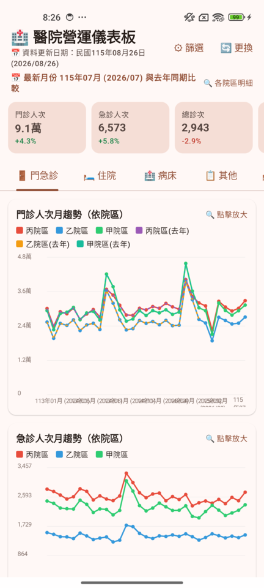
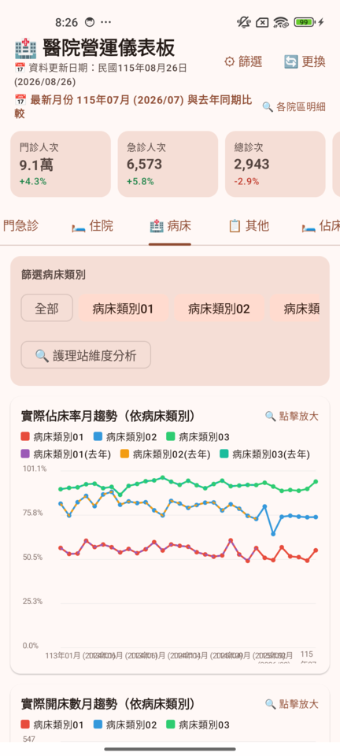
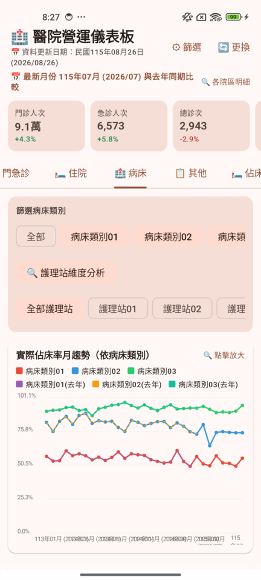
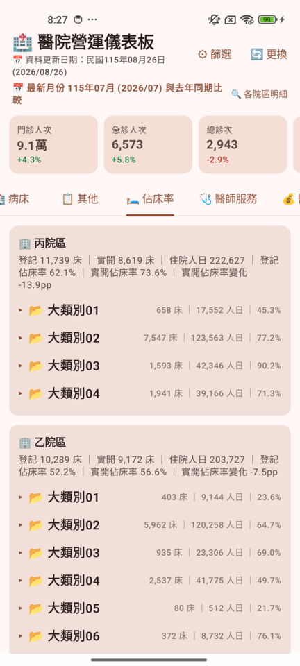
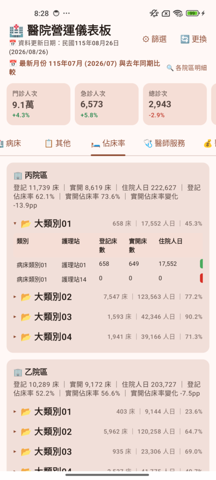

# 醫院營運儀表板 (Hospital Operations Dashboard) — Android

將 Python/Streamlit 版醫院業務儀表板改製為 Android APK 工具。

## 功能

- 📂 **檔案選取**：由使用者自行挑選手機中的業務資料表檔案（`業務資料-YYYYMMDD.xlsx`）
- 📅 **資料更新日期**：自動從檔名擷取民國年月日並顯示於儀表板
- 🗄️ **離線匯入**：解析 xlsx 工作表（門診/住院/病床/院外門診/會計/營運指標/醫師服務量，十餘萬列）至內建 SQLite，無需網路
- 📊 **儀表板 7 分頁**：門急診、住院、病床利用、其他服務、各院區佔床率明細、醫師服務量、醫師收入
- 📈 **KPI 快速摘要**：固定顯示資料最新一個月與去年同期比較；點擊展開各院區明細
- 🔍 **圖表橫向放大檢視**：點擊任一圖表卡片 → 橫向全螢幕顯示，支援雙指縮放/拖曳/雙擊；點擊資料點或長條顯示詳細數據與去年同期增減
- 🥧 **圓餅放大檢視（左明細右圓餅）**：收入結構圓餅點擊放大後，圓餅圖置於右方，左方呈現各區塊近三個月變化趨勢與去年同期增減情形
- 🤖 **AI 分析分頁**：動態 AI 引擎設定（本地 Ollama／自建 vLLM／Google Gemini／OpenAI／Custom Gateway，統一 OpenAI-Compatible 協定）＋連線測試；四步驟分析流程（輸入資料→脫敏比對預覽→串流輸出→Markdown 結果）；混淆對照表僅存本機、自動涵蓋新增院區/科別/醫師，AI 回傳可切換真實/脫敏視圖；報告可一鍵複製、匯出文字與 PDF
- ⚙️ **篩選**：年度/月份/院區/部別/科別（與 KPI 摘要分離），支援取消全選展開細項

## 技術

- Kotlin + Jetpack Compose（Material 3）
- 自製輕量 xlsx 解析器（ZipFile + XmlPullParser，零第三方依賴）
- 圖表以 Compose Canvas 自繪（折線/橫條/直條/圓餅/熱力表格）

| 欄位 | 混淆方式 | 數量 |
|---|---|---|
| 院區 | 甲／乙／丙院區 | 3 |
| 部別 | 部別01..14 | 14 |
| 科別 | 科別01..43 | 43 |
| 門診部 | 門診部01..08 | 8 |
| 醫師 | 醫師001..1616（代碼 DR0001..DR1616） | 1,616 |
| 護理站（病床服務量） | 護理站01..49 | 49 |
| 大類別（病床服務量） | 大類別01..06 | 6 |
| 病床類別（病床服務量） | 病床類別01..13 | 13 |

### 畫面

**① 門急診首頁** — 院區以甲／乙／丙院區呈現，KPI 與趨勢圖運作正常



**② 病床利用分頁** — 病床類別篩選為病床類別01..13，趨勢圖依類別繪製



**③ 護理站維度分析** — 護理站01..49 篩選與圖表



**④ 各院區佔床率明細** — 依大類別01..06 彙總各院區佔床率



**⑤ 展開大類別明細** — 類別／護理站層級表格（病床類別01、護理站01..）



## 版本

- **v0.3**：新增 AI 分析分頁（動態 AI 引擎設定與連線測試、混淆/還原引擎、四步驟分析流程、Markdown 結果與匯出）；混淆對照表自動涵蓋新增院區/科別/醫師（既有代號穩定）
- **v0.2.2**：修正 openpyxl 產出之 xlsx 無法匯入（支援絕對路徑工作表讀取）；空年度查詢防呆
- **v0.2.1**：當月收入結構圓餅圖修正（完整顯示、面積縮小、與清單間距調整）；圓餅放大檢視改為左明細右圓餅（近三個月趨勢＋去年同期比較）；關閉縮放後回到原分頁
- **v0.2**：新增醫師服務量、醫師收入分頁；篩選修復（可取消全選展開選項）；錨點月概念與近三個月趨勢、去年同期比較；點擊長條/資料點顯示明細
- **v0.1**：初始版本

## 建置

```bash
./gradlew :app:assembleDebug
# APK: app/build/outputs/apk/debug/app-debug.apk
```
